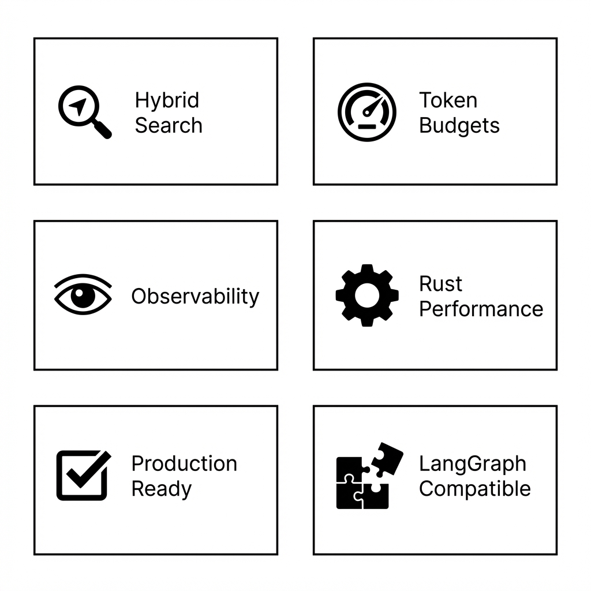
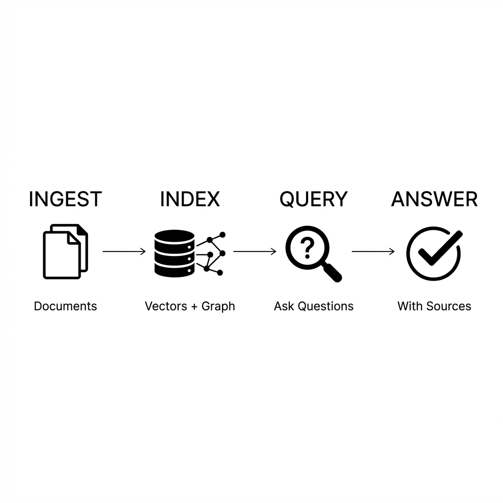

<p align="center">
  
</p>

<h1 align="center">Context Nexus</h1>

<p align="center">
  <strong>SDK for building agentic AI systems</strong>
</p>

<p align="center">
  <a href="https://pypi.org/project/context-nexus/"></a>
  <a href="https://pypi.org/project/context-nexus/"></a>
  <a href="LICENSE"></a>
</p>

<p align="center">
  <a href="#installation">Install</a> •
  <a href="#quick-start">Quick Start</a> •
  <a href="docs/quickstart.md">Tutorial</a> •
  <a href="docs/architecture.md">Architecture</a>
</p>

---

## What is Context Nexus?

Build AI applications that can search, reason, and answer questions over your documents.

<p align="center">
  
</p>

```python
agent = Agent(ContextNexus())
answer = await agent.query("What services depend on payments?")
print(answer.text, answer.sources)  # Answer with citations
```

---

## Why Context Nexus?

| Problem | Solution |
|---------|----------|
| Vector search alone isn't enough | **Hybrid retrieval**: vectors + graph |
| Context windows overflow | **Token budgets**: automatic limits |
| "Why did the AI say that?" | **Observability**: trace every step |
| Python is slow for hot paths | **Rust core**: optimized performance |

---

## Installation

```bash
pip install context-nexus
```

Requires Python 3.10+

---

## Quick Start

```python
import asyncio
from context_nexus import ContextNexus, Agent

async def main():
    nexus = ContextNexus()
    await nexus.ingest(["./my-docs/"])
    
    agent = Agent(nexus, token_budget=8000)
    answer = await agent.query("What is our refund policy?")
    print(answer.text)

asyncio.run(main())
```

---

## Features

- **Hybrid Retrieval** — Semantic search + graph reasoning
- **Token Budgets** — Never overflow context windows
- **Observability** — Trace every decision
- **Rust Performance** — Hot paths optimized
- **LangGraph Compatible** — Works with existing workflows

---

## Documentation

| Doc | Description |
|-----|-------------|
| [Quickstart](docs/quickstart.md) | Build your first agent |
| [Use Cases](docs/use_cases.md) | Workflow examples |
| [Architecture](docs/architecture.md) | Technical deep-dive |

---

## Contributing

See [CONTRIBUTING.md](CONTRIBUTING.md)

```bash
git clone https://github.com/chiraag-kakar/context-nexus
cd context-nexus
python -m venv venv && source venv/bin/activate
pip install -e ".[dev]"
pytest
```

---

## License

MIT © [Chiraag Kakar](https://github.com/chiraag-kakar)
